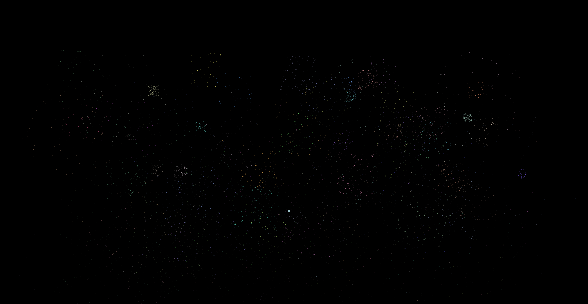

# Fireworks
New years fireworks simulation in C++

# Installation Linux
Clone the project with git and make sure you also have the submodule `CustomLibrary` cloned. Then create a build directory and run the cmake file.

# Preview

